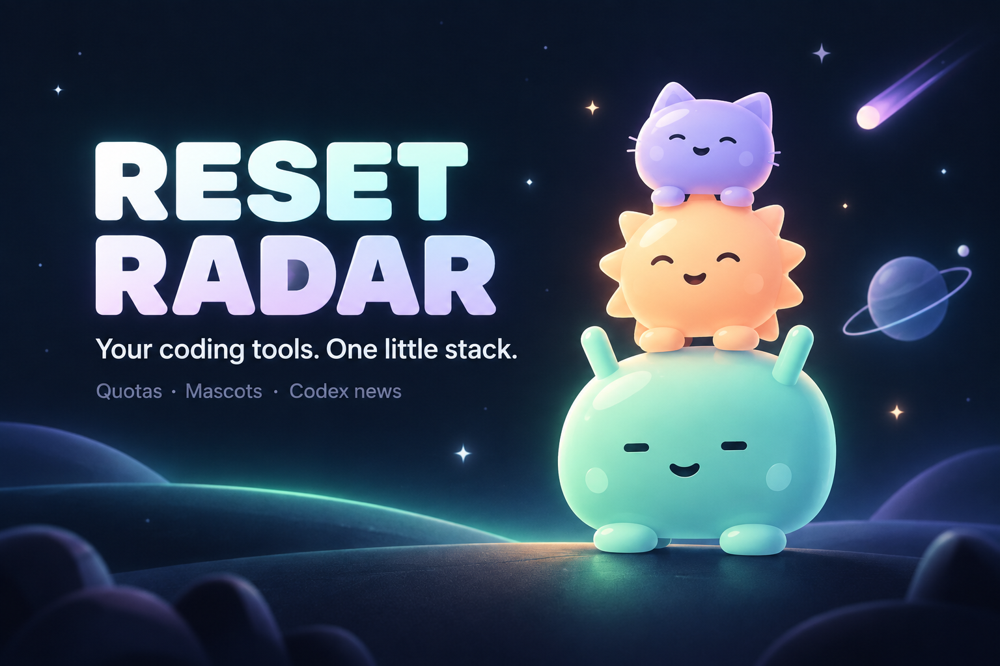
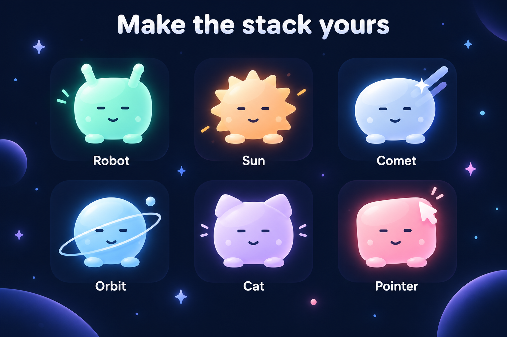

# Reset Radar

[](https://github.com/on9kitkit/reset-radar/actions/workflows/ci.yml)

A native macOS companion for coding-harness quotas and Codex surprise-reset news. Stack customisable mascots on your desktop, with the most important and largest mascot at the bottom. Click to expand available quotas, remaining percentages, routine reset times and banked reset credits. Drag to move without expanding.



*Product illustration. The largest mascot at the bottom is your highest-priority harness.*

Requires macOS 13 or later. Apple Silicon and Intel builds are included in the local build process. No third-party code dependencies.

## Build and check

Install Xcode with its command-line tools, then run from this folder:

```sh
python3 scripts/check-source.py
bash scripts/build.sh
python3 scripts/check-package.py
```

The build compiles both architectures with warnings treated as errors, runs offline regression tests, locally signs the app and writes `build/Reset Radar.zip` with a SHA-256 checksum. It does not read account credentials, call paid APIs, connect a harness, install the app or modify login items. Unzip the archive and move the app to your Applications folder to run it. Add it to macOS Login Items if you want automatic startup.

The signature is ad hoc. A public downloadable release still needs Developer ID signing and Apple notarization. See [the review record](CHECKS.md) for tested scope and remaining release checks.

## Automated checks

GitHub Actions runs on pushes to `main`, pull requests and manual dispatch. The `macOS build and offline tests` job uses the Intel macOS 15 runner with Xcode 16.4, compiles both architectures, runs the existing offline tests natively on Intel, checks source privacy and validates the extracted archive, license, checksum and signature. The workflow has read-only repository permission and a pinned checkout action. It receives no account keys or signing credentials and makes no paid API checks. Dependabot proposes weekly action updates.

Run the same commands above locally. The job summary records the exact commit and toolchain. These tests do not cover interactive desktop UI, live provider accounts, notarization or Intel user-interface behaviour.

## Customise and connect



*Illustrated gallery of the built-in designs. Each harness can use any mascot; other providers keep a fixed colour.*

Use the sliders button to change built-in mascot designs, colours, visibility and priority. Each higher mascot is 18% smaller. Customisation, Connections and Luna settings support scrolling and resizing; buttons show hover descriptions. Changes save automatically.

| Harness | Connection |
| --- | --- |
| Codex | Automatically finds the Codex CLI bundled in Codex or ChatGPT, or a standalone installation. Reads your existing signed-in account, available limits and reset credits. |
| Claude Code | Installs a local status-line quota reader after you sign in inside Claude Code. |
| Antigravity CLI | Installs a local status-line quota reader; this does not connect the editor alone. |
| Cursor, Grok, Muse | Reads a compatible usage JSON file. Native sign-in and built-in exporters are not implemented. |

For Codex, start with **Connect account**; sign in or switch accounts inside Codex itself. **Connection options → Find Codex again** repairs a moved or changed installation. The screen shows the detected app and last quota report. Claude and Antigravity offer **Reconnect usage** to repair their local readers.

Missing quotas stay unavailable. Old reports are labelled stale. Built-in status-line setup preserves the existing command and unrelated settings; disconnect restores the previous status line where possible and keeps newer edits. Configure providers while their settings are not being edited elsewhere. Read the [connection guide](Resources/Connection%20Guide.html) for setup and the exporter format.

## Codex news


Only the Codex mascot changes colour:

- Green: a successful check found no current reset announcement.
- Yellow: a reset is reported but its original post has not been verified, or news is unclear, unavailable or stale.
- Red: the news review directly verified a current explicit reset announcement with original X evidence.

Colours do not count down to routine resets. The optional news check watches `@thsottiaux`, `@reach_vb`, `@OpenAI` and `@OpenAIDevs`. The public ModelYard feed remains an indirect source for Tibo’s posts. There is no guarantee of advance notice: providers may not announce a surprise reset, X access may fail, and model interpretation can be wrong.

The news card separates the reported claim from its verification. **Reset reported** means the review found an explicit reset claim in search results or a public mirror, including a fresh discovery-feed candidate supplied to that same review. **Original unavailable** means the original X post could not be read; **Original not verified** means the claim is still indirect. These reports keep their headline and source links, so a yellow card can contain useful reset news. An access block such as X HTTP 403 does not become direct verification. Only direct verification can turn the mascot red or add an announced reset time to its countdown. Public news never proves that your own account refilled.

Open **News settings…** from the menu-bar paw, choose **Codex · use my plan**, leave **Check every → 1 hour** selected and enable **Enable scheduled news checks**. Then choose **Check news now**. The Codex checker uses your existing ChatGPT sign-in in the installed Codex CLI and counts toward your plan usage. It does not need a separate OpenAI API key and never falls back to a paid API request. Settings identify the requested CLI model and, when returned by an API review, the actual response model.

The optional **OpenAI API · billed separately** checker uses exactly `gpt-6-luna`. Its saved key stays in macOS Keychain. Model and web-search access depend on your API account; no other model is silently substituted. Choose this mode explicitly to use it. Checks and searches are billed to your OpenAI API project.

Both checkers share at most 48 attempts per UTC day, including retries, and a one-minute manual-check cooldown. Temporary failures receive up to two retries before the regular schedule resumes. The UI keeps the last successful review, its age, the current failure reason and next retry visible. Codex checks require a ChatGPT sign-in and pause when plan quota is exhausted. Local caps are not a billing or quota-consumption guarantee.

Reset Radar supplies public news queries, candidate titles and URLs; personal harness quotas stay local. Codex checks run from a private temporary folder with project instructions and local execution tools disabled. The CLI reuses your existing profile and may add installed skill names, paths and descriptions to its normal model context. The checker refuses nonempty global AGENTS instructions or integration settings that it cannot safely disable; it does not copy credentials into a separate profile. The API mode disables response storage. Search citations alone cannot establish a directly verified reset or an announced time. This remains a model-assisted check, not independent proof of post content.

No X login or X API key is required. There is no authenticated X API integration in this release. Original-post access can still fail. A successful no-announcement result requires a current search and accessible evidence from monitored sources. Cached reviews are marked stale after two hours. A directly verified completed reset is considered current news for 24 hours, but the review must still be fresh to turn the mascot red.

The Mac must be awake and the app running. Codex quotas refresh every minute, the indirect feed every five minutes and connected usage files every five seconds. No cloud monitor is included.

## Local data and sharing

Preferences belong to `local.resetradar.widget`. News and optional connection files live under `~/Library/Application Support/ResetRadar`. The OpenAI key belongs to the Keychain service `local.resetradar.openai`. Rebuilding or replacing this locally signed app may cause macOS to request Keychain access again; approve it yourself in the secure prompt.

This folder is the intended GitHub source root. It contains no runtime data, account files, API keys, personal launch agent, binaries or machine-specific paths. Build products are ignored. Review [SECURITY.md](SECURITY.md) before distributing a release.

## License

Copyright (c) 2026 on9kitkit. Licensed under the [MIT License](LICENSE). The license is also included in the app package.
